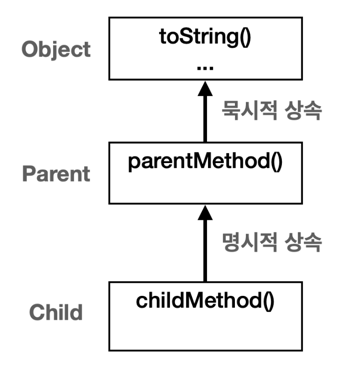

# Section01: Object 클래스

## Object 클래스
### 자바에서 모든 클래스의 최상위 부모 클래스는 항상 **Object** 클래스이다

  
### 이유
* 공통 기능 구현
  * 객체 정보 제공, 객체 같은 여부 비교, 객체가 어떤 클래스로 만들어졌는지 확인하는 것인 기본적으로 필요한 기능임
  * 이에 Object는 모든 객체가 필요로 하는 공통 기능을 제공함
    * `toString()`: 객체 정보 제공
    * `equals()`: 객체 같음 비교
    * `getClass()`: 객체 클래스 정보 제공 등
  

* 다형성의 기본 구현
  * Object는 모든 클래스의 기본 클래스임
  * 모든 자바 객체는 Object 타입으로 처리될 수 있음
  * Object 객체는 모든 객체를 전부 담을 수 있어, 어느 타입의 객체든 Object에 보관 가능함
  

---
  
## Object 다형성

